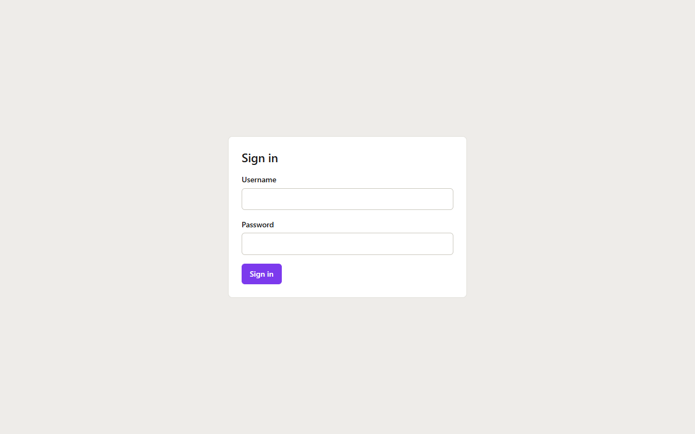

# LazySentry

**Self-hosted security & maintenance dashboard for your repositories.**

One `docker compose up -d`, one browser tab — and for every repository you care about you can see:

- 🛡️ **Vulnerabilities** — all direct and transitive dependencies checked against the [OSV database](https://osv.dev)
- 📦 **Outdated packages** — installed vs. latest registry version, classified as patch / minor / major
- 🔑 **Leaked secrets** — working tree *and* full git history scanned with [TruffleHog](https://github.com/trufflesecurity/trufflehog), including live verification of found credentials

> **Status: MVP.** Dependency/CVE tracking, version auditing, secret detection, GitHub import and the dashboard are implemented and covered by tests. Pre-1.0 — expect rough edges, and see the roadmap below for what's intentionally not here yet.

## Screenshots



More screenshots (setup wizard, dashboard, project detail) are coming as the UI settles.

## Who is this for?

Individual developers and small teams with **5–50 repositories**. The individual scanners already exist as excellent open-source tools, and enterprise aggregation platforms exist too — but they come with multiple services, role models, and heavyweight setup. LazySentry fills the gap in between: **one container, five minutes of setup**, and a dashboard you actually want to open.

The value is not in custom scan engines — it's in orchestration, tracking findings over time, and a UI that answers three questions for every finding without a click: *What is this? How bad is it? What do I do now?*

## Key principles

- **Your code stays on your infrastructure.** Repositories are cloned to a temporary directory inside the worker container, scanned, and deleted. No source code leaves your server.
- **Raw secrets are never stored.** TruffleHog findings are immediately reduced to a fingerprint and a masked preview (`AKIA…IFXG`). The plaintext never touches the database, logs, or error messages.
- **No false green.** A state where nothing was scanned (e.g. no lockfiles found) always looks different from a state where nothing was found.
- **Findings are tracked over time.** A vulnerability or secret is one record per project — you see when it first appeared, when it was resolved, and if it comes back.

> ⚠️ **Note on secret verification:** TruffleHog verifies found credentials by testing them live against the respective provider's API (e.g. an AWS key via `GetCallerIdentity`). This means your server makes **outbound network requests to third parties** during scans. Verification can be disabled per project if that is not acceptable in your environment.

## Architecture

A single Docker image with two processes and a SQLite database on a shared volume:

```
┌──────────────────────┐    ┌─────────────────────┐
│  api                 │    │  worker             │
│  Fastify + React UI  │    │  scan queue loop    │
│                      │    │  + scanner binaries │
└──────────┬───────────┘    └──────────┬──────────┘
           └───────────┬───────────────┘
                ┌──────▼───────┐
                │   SQLite     │  (volume)
                └──────────────┘
```

- **No Redis, no external queue** — jobs live in a SQLite table, polled by the worker. Zero operational overhead.
- **Scanner binaries** (osv-scanner, TruffleHog) are pinned to exact versions and baked into the image; every scan records the versions that produced it.
- **Hardened worker** — the worker processes untrusted repository content (foreign dependencies, foreign git history) and therefore runs as non-root with all capabilities dropped.
- Scan status updates reach the browser via Server-Sent Events — no client-side polling.

## Tech stack

TypeScript end to end: [Fastify](https://fastify.dev) backend, [React](https://react.dev) + [Vite](https://vite.dev) frontend, [Drizzle ORM](https://orm.drizzle.team) on SQLite, [Zod](https://zod.dev) for validation, [TanStack Query](https://tanstack.com/query) for data fetching.

```
apps/api          Fastify server (serves API + built frontend) and the scan worker
apps/web          React frontend
packages/shared   Zod schemas & types shared between API and frontend
docs/CONCEPT.md   Full product & implementation spec (German)
docs/SETUP.md     Step-by-step setup guide (Docker, GitHub token, first scan)
Dockerfile, docker-compose.yml   Production image and two-service setup
```

## Getting started (Docker)

This is the supported way to run LazySentry. Requires Docker and Docker Compose v2.

```sh
git clone https://github.com/PsydoV2/lazysentry.git
cd lazysentry
cp .env.example .env
# generate a key and paste it into .env as APP_ENCRYPTION_KEY:
node -e "console.log(require('crypto').randomBytes(32).toString('hex'))"

docker compose up -d --build
```

Open **http://127.0.0.1:3000** — you land in the setup wizard (create the
admin account, then connect GitHub with a personal access token scoped to
`Contents: read` + `Metadata: read`). Full walkthrough, including exactly
which GitHub token permissions to grant and how to read the dashboard once
it's populated: **[docs/SETUP.md](docs/SETUP.md)**.

`docker-compose.yml` runs two containers on one image and one shared SQLite
volume — `api` (the dashboard) and `worker` (runs scans), both non-root with
all capabilities dropped and a read-only root filesystem (docs/CONCEPT.md
6.2). The published port is bound to `127.0.0.1`; put a reverse proxy in
front to expose it beyond the host.

## Getting started (development)

Requires Node.js ≥ 22 and [pnpm](https://pnpm.io).

```sh
pnpm install
cp .env.example .env        # then fill in APP_ENCRYPTION_KEY (see comments in the file)
pnpm dev                    # starts the API (127.0.0.1:3000), the scan worker and the web dev server
```

Scans are executed by the **worker**, not by the API — a queued scan stays
queued until a worker is running. In development both run in one process
(`node dist/main.js --with-worker`, see `docs/CONCEPT.md` 0.2), which is what
`pnpm dev` starts. To run them separately, use `dev:api` and `dev:worker` in
`apps/api`; production runs `node dist/api.js` and `node dist/worker.js` as
two services on the same image.

For local development the worker needs both scanner binaries. Download a
pinned release of [osv-scanner](https://github.com/google/osv-scanner/releases)
and [TruffleHog](https://github.com/trufflesecurity/trufflehog/releases) and
point `OSV_SCANNER_PATH` / `TRUFFLEHOG_PATH` in `.env` at them (the Docker
image bakes both in). The worker warns at startup about a binary it cannot
execute; scans then record that scanner as failed instead of pretending the
repository is clean.

Other commands: `pnpm build` (all packages), `pnpm test`, `pnpm typecheck`.

## Roadmap

**MVP (done):** dependency & CVE tracking, version auditing, secret detection with verification, GitHub import via personal access token, dashboard with per-project detail view, Docker Compose setup.

**After the MVP:** notifications (Discord first) & scheduled scans → EPSS/CISA-KEV prioritization → AI-assisted triage & upgrade hints → multi-provider support (GitLab, Bitbucket) & SBOM export.

## License

Not yet decided.
